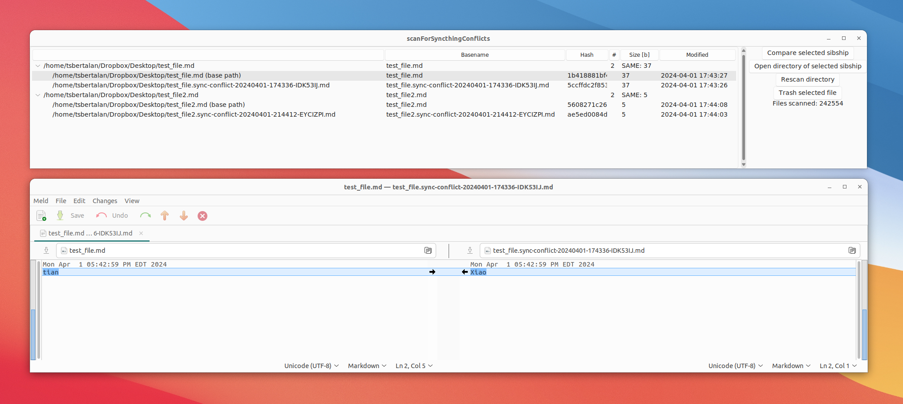

# Scan for SyncThing Conflicts

Syncthing will routinely create conflict files when there's some ambiguity in which is the correct version of a file. On Windows, the SyncTrayzor program includes a nice conflicts browser, but I don't know about anything similar on Linux.

So here's a cross-platform program for that purpose.

It scans the given root dir for sibling groups of conflict file(s)+main file, provides:

1. Some information about each including filesize, hash if the files aren't too big, and date modified
2. A way to easily opening Meld to see the difference between between the two files (or the first three if there are more than 2 in the sibship)
3. A button to send a selected file to the system trash.

Scanning takes about three seconds on my i7-3770 Ubuntu machine to look at about a quarter million files (but that's probably greatly aided by file system caching--it might take thirty seconds from scratch).
